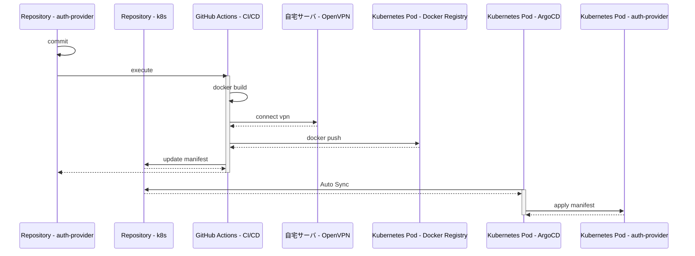

# auth-provider

[](https://github.com/kuroweb/auth-provider/actions/workflows/cicd.yml)

- OpenID Connect学習用リポジトリ
- OPとして実装している

## 技術スタック

- Rails
- OpenID Connect（OP）

## インフラ構成

### Development

- Docker Compose

  ```mermaid
  flowchart LR
  subgraph Docker Compose
    subgraph proxy
      nginx_auth[Nginx Auth]
    end

    subgraph OpenID Provider
      rails_auth[Rails Web]
    end

    subgraph Databases
      mysql[(MySQL)]
      redis[(Redis)]
    end
  end

  client-->nginx_auth-->rails_auth
  rails_auth-->Databases
  ```

### Production

- 自宅Kubernetes (Master Node x 1, Worker Node x 3構成)

  ```mermaid
  flowchart LR
  subgraph Kubernetest Node
    subgraph Ingress Controller
      nginx_auth[Nginx Auth]
    end

    subgraph OpenID Provider
      rails_auth[Rails Web]
    end

    subgraph Databases
      mysql[(MySQL)]
      redis[(Redis)]
    end
  end

  client-->nginx_auth-->rails_auth
  rails_auth-->Databases
  ```

## セットアップ手順

- OpenID Provider(auth_providerコンテナ)の秘密鍵を作成

  - opensslをインストール（環境差異の大きなライブラリなので参考程度）

    ```bash
    $ brew install openssl
    ```

  - 秘密鍵を作成

    ```bash
    $ openssl genrsa -out volumes/backend/certs/private.pem 2048
    ```

- nginx用の証明書発行
  - mkcertをインストール

    ```bash
    $ brew install mkcert
    $ mkcert -install
    ```

  - 証明書発行

    ```bash
    $ mkcert \
      -cert-file ./volumes/nginx/certs/fullchain.pem \
      -key-file ./volumes/nginx/certs/privkey.pem \
      dev.auth-provider.com
    ```

  - ループバックエイリアスを追加（TODO: just upで自動化）

    ```bash
    sudo ifconfig lo0 alias 127.0.0.2 up
    ```

  - /etc/hosts に以下を記述

    ```bash
    127.0.0.2 dev.auth-provider.com
    ```

- Dockerイメージビルド

  ```bash
  $ docker compose build
  ```

- コンテナ起動

  ```bash
  $ just up
  ```

- コンテナ停止

  ```bash
  $ just down
  ```

- ローカル環境
  - 認証プロバイダー: https://dev.auth-provider.com/

## ER

- TBA

## 自動デプロイ

- ArgoCDによるGitOps
- [k8sマニフェスト](https://github.com/kuroweb/k8s)


